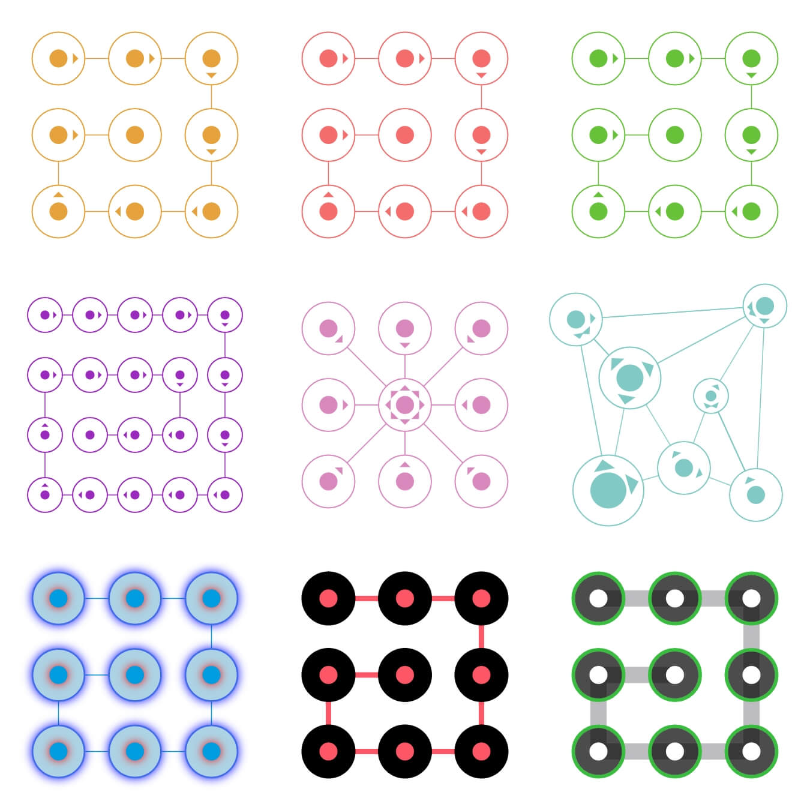

## ✨ Fly Gesture Unlock

功能完善，强大的 web 端手势解锁库，一站式解决手势解锁相关业务。


## 🎉 我的所有开源库
> fly-barrage: web 端弹幕库，Gitee 推荐项目。
> 
> gitee: https://gitee.com/fei_fei27/fly-barrage;
> 
> github: https://github.com/feiafei27/fly-barrage;

> fly-gesture-unlock: web 端手势解锁库。
>
> gitee: https://gitee.com/fei_fei27/fly-gesture-unlock;
>
> github: https://github.com/feiafei27/fly-gesture-unlock;

## 🎥 渲染效果



## 📝 官方网站

<https://fly-gesture-unlock.netlify.app/>

## 🎄 在线体验

<https://fly-gesture-unlock-online.netlify.app/>

## 📥 安装

```bash
npm install fly-gesture-unlock
```

## 🌍 用法
```vue
<!-- 这里使用 Vue 框架作为例子，本库并不局限于特定框架 -->
<template>
  <div class="page-container">
    <div
      id="container"
      ref="container"
      style="width: 300px; height: 300px;"
    />
  </div>
</template>

<script setup lang="ts">
  import GestureUnlockRenderer, { Anchor } from 'fly-gesture-unlock';
  import { ref, onMounted } from 'vue';

  // 定义额外状态
  type ExtraStatus = never;

  const container = ref();
  const gestureUnlockRenderer = ref<GestureUnlockRenderer<ExtraStatus>>();

  onMounted(() => {
    // 借助提供的辅助函数生成锚点
    const anchorDefines = GestureUnlockRenderer.AnchorMatrixFactory({
      canvasSize: { width: container.value.clientWidth, height: container.value.clientHeight },
      padding: 35,
      matrix: { row: 3, column: 3 },
      anchor: { anchorCircleRadius: 30, centerCircleRadius: 10 },
    });

    gestureUnlockRenderer.value = new GestureUnlockRenderer<ExtraStatus>({
      container: container.value,
      anchorDefines,

      anchorStatusStyles: {
        'not-selected': {
          // 锚点圆的边框宽、边框颜色、填充颜色
          anchorCircleBorderWidth: 1,
          anchorCircleBorderColor: '#3ea1e5',
        },
        'selected': {
          // 锚点圆的边框宽、边框颜色、填充颜色
          anchorCircleBorderWidth: 1.5,
          anchorCircleBorderColor: '#128ce8',
          anchorCircleFillColor: '#ffffff',

          // 中心圆的边框宽、边框颜色、填充颜色
          centerCircleFillColor: '#128ce8'
        },
      },
      lineStatusStyles: {
        'normal': {
          lineColor: '#128ce8',
          lineWidth: 1,
        },
      },
      events: {
        'end': gestureEnd,
      },
    });
  });

  const gestureEnd = (selectedAnchors: Anchor<ExtraStatus>[]) => {
    const anchorIds = selectedAnchors.map(anchor => anchor.id).join('');
    console.log(anchorIds);
  };
</script>

<style>
  * {
    padding: 0;
    margin: 0;
  }

  .page-container {
    height: 100vh;
    display: flex;
    align-items: center;
    justify-content: center;
    background-color: #446693;
  }

  #container {
    background-color: #ffffff;
  }
</style>
```
完整用法，请直接 clone 项目，安装依赖后，执行 npm run dev 即可看到完整用法

尽量使用高版本 node，我本地的版本是 v18.19.0

## 🌲 License
[MIT License](LICENSE)